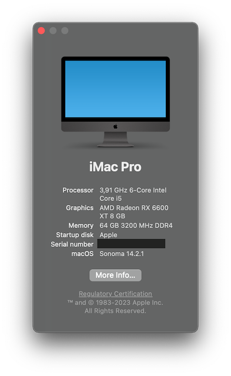

# ASRock_Z590M_ITX-AX_i5-11600K Hackintosh

EFI for ASROCK Z590M ITX/AX with OpenCore bootloader



### Specs:

| Component        | Brank                              |
| ---------------- | ---------------------------------- |
| CPU              | Intel Core i5 11600K               |
| GPU              | ASRock RX 6600 XT 8GB              |
| Lan 2.5GBE       | Realtek 8125                       |
| Lan 1GBE         | Intel I219 V11                     |
| Audio            | Realtek ALC897                     |
| Ram              | 64GB DDR4 3200 MHz                 |
| Wireless.        | Broadcom BCM94360NG                |
| 1° NVMe SSD      | Corsair MP600 PRO 2TB              |
| SmBios           | iMacPro1,1                         |
| BootLoader       | OpenCore 0.9.7                     |
| macOS            | Sonoma 14.2.1                      |


### Works:

- [x] AMD RX 6600 XT HDMI/DP OUTPUT
- [x] ALC 897 AUDIO (Sound, Mic)
- [x] USB Ports, ports mapped (I don't use internal ports, you need to remap ports if necessary)
- [x] Sleep, Wake, Speedstep
- [x] 1° CONTROLLER NVME PciE Gen4x4
- [x] 2° CONTROLLER NVME PciE Gen3x4
- [x] CONTROLLER SATA III
- [x] All Sensors (CPU, GPU, NVME, SATA, FANS)
- [x] Realtek RTL8125 LAN
- [x] Intel I219 V11 LAN
- [x] Broadcom BCM94360NG WiFi+BT
- [x] NVRAM

### macOS Sonoma Wi-Fi issues
As you may know, all socketed Broadcom Wifi cards became unsupported after Sonoma release. But I've restored it's functionality including various functions such as Airdrop, etc...  
For Wi-Fi, I've followed this guide (https://github.com/dortania/OpenCore-Legacy-Patcher/pull/1077) from "Hackintosh notes".

### Filevault and root patches issues
As described above, you have to apply OLCP root patches. But OLCP requires Filevault to be disabled. So before applying root patches, you should completely decrypt your drive.

### After root patching, can't turn on FileVault back, tells me that password is incorrect!
Yes, you should workaround it by adding new boot arg (-arv_allow_fv) (already added here) and add kernel patch for filevault override (already added here too)

### But system update will revert root patches back to stock state!
Yes, update process is more complicated than before, on Monterey. I haven't installed any minor Sonoma updated yet, but that workflow should be valid:
- Disable FileVault and decrypt drive completely
- Revert root patches
- Update system
- Install root patches
- Enable FileVault and encrypt drive

### MacOS bootable USB creation:
- Read the Dortania guide for creating your USB from Windows or macOS
- [Guide Dortania](https://dortania.github.io/OpenCore-Install-Guide/installer-guide/) - USB creation

## Bios settings
### Enable :
* SATA Operation : AHCI
* XHCI Hand-Off
* ABOVE 4G
* XMP 2.0 Profile 1 or AUTO
* Primary Graphics Adapter : PEG

### Disable : 
* Secure Boot
* Intel SGX
* Fastboot
* CFG LOCK
* Boot From Onboard LAN
* CSM
* IGPU Multi-Monitor

## Windows 10 dual-boot:
You need to install rEFInd with [this guide](https://github.com/dortania/Hackintosh-Mini-Guides/blob/master/refind.md), because booting Windows from Opencore is not good.
My refind.conf:
```
timeout 10

menuentry "Apple" {
    icon \EFI\refind\icons\os_mac.png
    volume 0E239BC6-F960-3107-89CF-1C97F78BB46B
    loader /EFI/OC/OpenCore.efi
}
menuentry "Shindows" {
    icon \EFI\refind\icons\os_win8.png
    volume 63A2FC5D-4F50-46ED-8DAD-B0AF52E2AEDC
    loader \EFI\Microsoft\Boot\bootmgfw.efi
}
menuentry "EFI Shell" {
    icon \EFI\refind\icons\tool_shell.png
    loader \EFI\tools\Shell_Full.efi
}

scanfor manual,external
```

## Credits

- [Apple](https://apple.com) for macOS;
- [Dortania](https://dortania.github.io/OpenCore-Install-Guide/config-laptop.plist/icelake.html) For great and detailed guides.
- [Hackintoshlifeit](https://github.com/Hackintoshlifeit) for Bios settings and part of readme;
- [Insanelymac](https://insanelymac.com) for files, experience and manuals.
